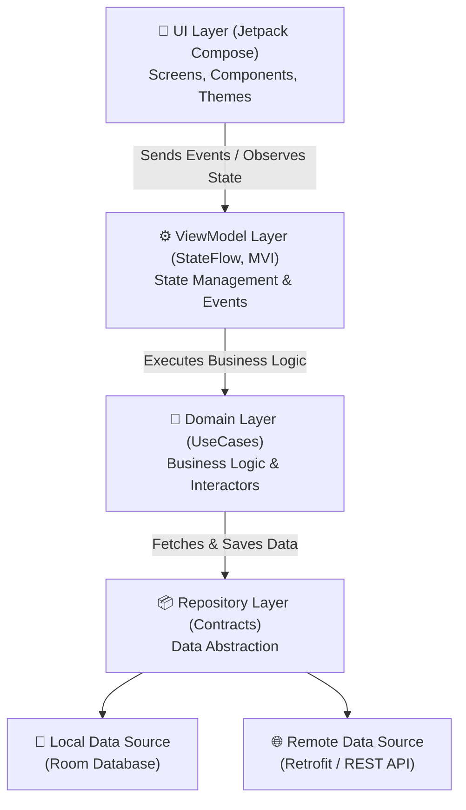
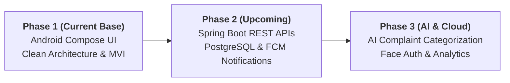

# 🏢 Community OS – Smart Community Management Platform

> **Tagline:** *Building smarter, safer, and more connected communities.*

[](https://developer.android.com)
[](https://kotlinlang.org)
[](https://developer.android.com/jetpack/compose)
[](https://developer.android.com/topic/architecture)
[](https://dagger.dev/hilt/)

---

## 📌 Executive Summary & Vision

**Community OS** is an all-in-one digital ecosystem engineered for modern residential gated communities, apartment complexes, villas, and housing societies. It bridges the gap between **society administration**, **guard room security operations**, **social engagement**, and **local resident services**.

Rather than serving solely as a maintenance ledger or visitor tracker, **Community OS** connects residents, enables instant emergency assistance, facilitates local skill-sharing and marketplaces, and simplifies daily apartment living.

---

## 🎯 Problem Statement & Objectives

### Current Challenges in Modern Residential Communities:
1. **Fragmented Communication:** Heavy reliance on unorganized WhatsApp groups, paper noticeboards, and physical phone calls.
2. **Manual & Unsafe Visitor Management:** Inefficient logbooks with no photo verification or instant resident approval.
3. **Low Community Engagement:** Isolation among neighbors, low event participation, and underutilized talent/skills within the society.
4. **Opaque Maintenance & Complaints:** Lack of real-time complaint tracking, priority assignment, and financial status visibility.

### Key Objectives of Community OS:
- 🛡️ **Secure Security Management:** Gate visitor verification with photo uploads and real-time resident approval.
- 🚨 **Instant Emergency Response:** One-tap SOS alerts dispatching notifications to guards, emergency contacts, and society admins.
- 🤝 **Hyper-Local Networking:** Private resident feed, interest-based clubs (coding, music, sports, gardening), and peer-to-peer skill listing.
- 📑 **Transparent Governance:** Easy maintenance payment tracking, structured complaint management, and community analytics.

---

## 👥 Target Roles & Access Control

The platform enforces **Role-Based Access Control (RBAC)** across three primary user personas:

| Role | Primary Responsibilities & Features |
| :--- | :--- |
| **Resident** | Profile management, Joining clubs, Emergency SOS alerts, Approving visitors, Raising complaints, Event participation, Community feed, Marketplace & Maintenance dues tracking. |
| **Admin** | Managing residents & flat mappings, Assigning complaint priorities, Broadcasting announcements, Society treasury management, Event hosting, and Viewing Community Analytics. |
| **Security Personnel** | Visitor entry creation, Capturing visitor photos, Sending instant approval requests to flat owners, Maintaining entry/exit logs, Managing gate security. |

---

## 🏗️ Architecture & Technology Stack

The project adopts **Android Clean Architecture** with **MVVM/MVI design pattern**, single-activity Jetpack Compose architecture, and unidirectional data flow (UDF).



### Technical Stack Details:

- **Language:** [Kotlin 1.9.22](android/gradle/libs.versions.toml) (Target SDK 34, Min SDK 26, JVM 17)
- **UI Framework:** [Jetpack Compose](android/app/build.gradle.kts) with Material 3 Design Tokens, Custom Typography, Shapes, and Colors.
- **Dependency Injection:** [Dagger Hilt 2.50](android/app/src/main/java/com/communityos/authentication/di/AuthModule.kt) with KSP (`@HiltAndroidApp`, `@HiltViewModel`, `@AndroidEntryPoint`, `@Module`, `@InstallIn`).
- **Navigation:** [Jetpack Compose Navigation](android/app/src/main/java/com/communityos/navigation/AppNavigation.kt) with type-safe route parameters and modular nested graphs (`authGraph`, `homeGraph`).
- **Networking & Persistence:** Retrofit 2 (v2.9.0), Gson Converter, OkHttp Logging Interceptor, and Room Database (v2.6.1) ready for offline caching.
- **Asynchronous Execution:** Kotlin Coroutines & `StateFlow` for state handling.

---

## 📁 Repository Structure

```text
Community-helper/
├── README.md                          # Main Project Documentation
├── project description.docx           # Product Requirement & Feature Roadmap Spec
├── backend/                           # Reserved directory for Spring Boot REST APIs
└── android/                           # Native Android Application Source
    ├── build.gradle.kts               # Root Gradle Configuration
    ├── gradle.properties              # Project Properties & Memory Allocation
    ├── settings.gradle.kts            # Module inclusions & Plugin Repositories
    └── app/
        ├── build.gradle.kts           # Dependencies, Compose Compiler & SDK settings
        └── src/
            └── main/
                ├── AndroidManifest.xml # Permissions (INTERNET, CAMERA) & Activity Setup
                ├── res/                # XML Resources, Strings & App Themes
                └── java/com/communityos/
                    ├── CommunityApp.kt           # Hilt Application Entry Point
                    ├── MainActivity.kt           # Single Activity with AppNavigation
                    │
                    ├── admin/                    # Admin Dashboard Screen
                    ├── analytics/                # Analytics Module Placeholders
                    ├── api/                      # Retrofit ApiService Endpoints
                    ├── authentication/           # Modular Auth Feature
                    │   ├── components/           # Reusable Auth UI Components
                    │   ├── di/                   # Hilt Auth Module Bindings
                    │   ├── domain/               # Auth UseCases (SendOtp, VerifyOtp, etc.)
                    │   ├── event/                # Auth MVI Events (AuthEvent)
                    │   ├── model/                # Auth Data Models (AuthUser)
                    │   ├── navigation/           # Nested Auth NavGraph (authGraph)
                    │   ├── repository/           # AuthRepository Contract & Implementation
                    │   ├── state/                # Auth UI State (AuthState)
                    │   ├── ui/                   # Auth Screens (Splash, Login, OTP, etc.)
                    │   └── viewmodel/            # AuthViewModel
                    │
                    ├── clubs/                    # Club Details & Community Groups
                    ├── communityfeed/            # Private Social Feed
                    ├── complaints/               # Complaint Creation & Tracking
                    ├── components/               # Shared Reusable UI Components
                    ├── emergency/                # SOS & Emergency Alert System
                    ├── events/                   # Community Events System
                    ├── home/                     # Resident Main Feature Module
                    │   ├── components/           # EmergencyCard & MetricCard UI
                    │   ├── di/                   # Hilt Home Module
                    │   ├── domain/               # Dashboard & SOS UseCases
                    │   ├── event/                # Home MVI Events (HomeEvent)
                    │   ├── model/                # DashboardSummary Model
                    │   ├── navigation/           # Home NavGraph (homeGraph)
                    │   ├── repository/           # HomeRepository Contract & Implementation
                    │   ├── state/                # Home UI State (HomeState)
                    │   ├── ui/                   # DashboardScreen, HomeScreen, ProfileScreen
                    │   └── viewmodel/            # HomeViewModel
                    │
                    ├── maintenance/              # Treasury & Dues Module Placeholders
                    ├── marketplace/              # Local Product & Service Marketplace
                    ├── models/                   # Core Data Models (User, etc.)
                    ├── navigation/               # Root Navigation (AppNavigation & Screen)
                    ├── notifications/            # Notification Center Placeholders
                    ├── profile/                  # User Profile Management
                    ├── repository/               # BaseRepository Infrastructure
                    ├── security/                 # Gate Guard Dashboard Screen
                    ├── ui/theme/                 # App Colors, Typography & Material3 Theme
                    ├── utils/                    # Constants & App Utilities
                    └── visitors/                 # Visitor Approval Details Screen
```

---

## 🚀 Detailed Features & App Workflows

### 1. 🔐 Onboarding & Multi-Step Authentication Flow
- **Splash & Onboarding:** Animated splash screen transitioning into feature introduction carousels.
- **Phone OTP Login:** User inputs phone number; receiving test OTP simulation (`123456` or `000000`).
- **New User Registration:** User supplies Full Name & Email address if registering for the first time.
- **Community Selection:** Search and select from registered apartment complexes (e.g., *Orchard Heights Apartments*).
- **Flat & Role Verification:** Select flat number (e.g., *B-304*) and choose target role (`Resident`, `Admin`, `Security`).

### 2. 🏠 Resident Dashboard (`HomeScreen`)
- **Community Header:** Displays selected society name, block number, and flat unit.
- **One-Tap Emergency SOS Card:** Instant buttons for **Medical**, **Fire**, and **Security** emergencies. Triggers live red banner alert state with dismiss controls.
- **Live Metrics Overview:**
  - 👥 **Active Visitors** counter with quick navigation to visitor approvals.
  - ⚠️ **Pending Complaints** count with quick action to report issues.
  - 💳 **Maintenance Dues Card** showing outstanding balance ($120.50) with instant "Pay Now" action.
- **Bottom Navigation Bar:** Seamless toggle between **Home**, **Feed**, **Events**, **Marketplace**, and **Profile**.

### 3. 🛡️ Guard Room / Security Dashboard (`SecurityDashboardScreen`)
- Specialized interface designed for security personnel at entry gates.
- Log new visitors, capture visitor photographs, trigger push notifications to flat owners, and review visitor entry/exit history.

### 4. ⚙️ Admin Dashboard (`AdminDashboardScreen`)
- Centralized hub for society board members and admins.
- Moderate community posts, process flat verification requests, post announcements, track treasury dues, and view society health analytics.

### 5. 🛠️ Specialized Feature Screens & Placeholders
- **Visitor Details Screen (`VisitorDetailsScreen`):** Deep dive into individual visitor profile, approval status, entry time, and photo verification.
- **Create Complaint Screen (`CreateComplaintScreen`):** File maintenance/security grievances with photo attachment support and auto-priority tagging.
- **Club Details Screen (`ClubDetailsScreen`):** Information page for society clubs (e.g., Coding Club, Badminton Club, Music Circle).
- **Modular Placeholders:** Pre-configured UI scaffolds for Community Feed, Local Marketplace, Maintenance Receipts, Notifications, and Analytics.

---

## 🛠️ Environment Requirements & Prerequisites

To build and run the **Community OS** Android app on your machine, ensure you have:

- **Operating System:** Windows 10/11, macOS, or Linux.
- **IDE:** [Android Studio](https://developer.android.com/studio) (Version *Iguana 2023.2.1*, *Jellyfish 2024.1.1*, *Ladybug*, or higher recommended).
- **JDK Version:** JDK 17 (Java Development Kit 17).
- **Android SDK:**
  - Compile SDK: `34` (Android 14)
  - Target SDK: `34` (Android 14)
  - Min SDK: `26` (Android 8.0 Oreo)
- **Emulator / Device:** Android Virtual Device (AVD) running Android 8.0+ or a physical Android phone with USB Debugging enabled.

---

## ⚙️ How to Build, Test, and Run

### Step 1: Open the Project in Android Studio
1. Open **Android Studio**.
2. Select **Open** and browse to the repository folder: `android`.
3. Allow Android Studio to import the project and perform the initial Gradle Sync.

### Step 2: Gradle Build & Verification
To test and compile the project using Gradle command line or IDE:
```bash
# Navigate to the android root folder
cd android

# Build Debug APK (On Windows PowerShell / CMD)
.\gradlew assembleDebug

# Run Kotlin Linter / Checks (if configured)
.\gradlew check
```

### Step 3: Run on Emulator or Physical Device
1. Connect your Android device via USB or start an Android Virtual Device (AVD).
2. Select the `app` configuration in Android Studio's top toolbar.
3. Click **Run** `(Shift + F10)` or debug `(Shift + F9)`.

---

## 🧪 Testing Guide & Demo Workflows

You can interactively test the complete workflow using the built-in mock repositories:

### 1. Test Authentication & Multi-Role Navigation
- **Step 1:** On launch, click **Get Started** on the Onboarding screen.
- **Step 2:** Enter a valid 10-digit phone number (e.g., `9876543210`) and tap **Send OTP**.
- **Step 3:** Enter the test verification code **`123456`** (or `000000`) and tap **Verify OTP**.
- **Step 4:** If prompted, enter your Full Name & Email address and tap **Continue**.
- **Step 5:** Select any community (e.g. *Orchard Heights Apartments*) and proceed.
- **Step 6:** Enter your flat number (e.g., `B-304`) and select your role:
  - Select **Resident** ➡️ Redirects to the **Resident Dashboard**.
  - Select **Admin** ➡️ Redirects to the **Admin Dashboard**.
  - Select **Security** ➡️ Redirects to the **Security Dashboard**.

### 2. Test Emergency SOS Alert Dispatch
- On the **Resident Dashboard**, locate the **Emergency Card**.
- Tap **Medical**, **Fire**, or **Security**.
- **Result:** An active alert banner immediately pops up displaying `Active Alert: Medical Triggered!`. Tap **Dismiss** to resolve the state.

### 3. Test Profile & Logout
- Tap the **Profile** tab on the bottom navigation bar.
- Review user profile details and tap **Logout**.
- **Result:** Session clears and user is securely returned to the **Login Screen**.

---

## 🗺️ Project Roadmap & Future Scope



- [x] **Phase 1 (Current Base):** Complete Android UI implementation, Jetpack Compose Design System, Clean Architecture, Hilt DI, and MVI navigation graphs for all major modules.
- [ ] **Phase 2 (Backend & Cloud):** Spring Boot REST API integration in `backend/`, PostgreSQL database schema deployment, Firebase Phone Auth, Cloudinary visitor image storage, and FCM push notifications.
- [ ] **Phase 3 (AI & Intelligent Insights):** AI-powered automatic complaint categorization, community engagement health scores, event recommendations, and smart maintenance prediction.

---

## 📚 Documentation

- [Communities & Flats](android/COMMUNITIES.md)

---

## 📄 License & Contact

This project is created for smart community management research and development. 

*For inquiries or collaboration, please refer to the project specification in [`project description.docx`](project%20description.docx).*